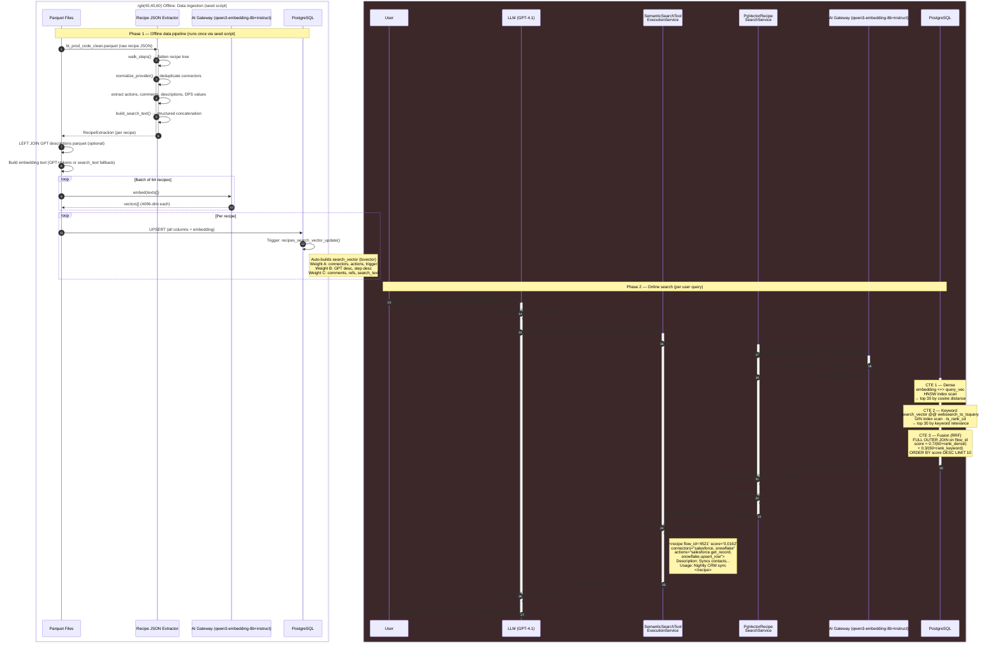
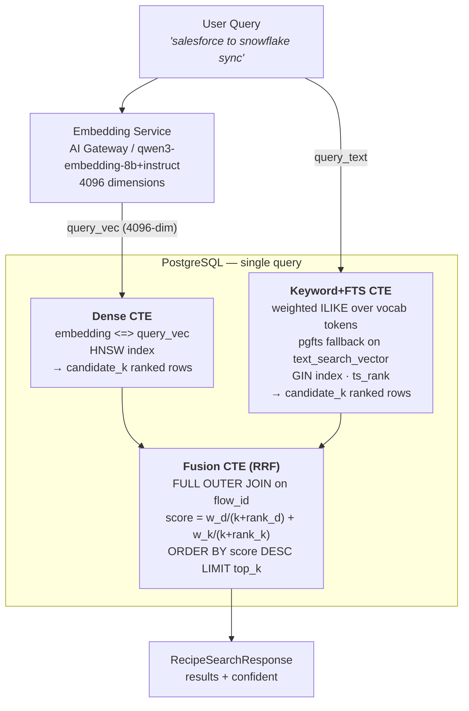
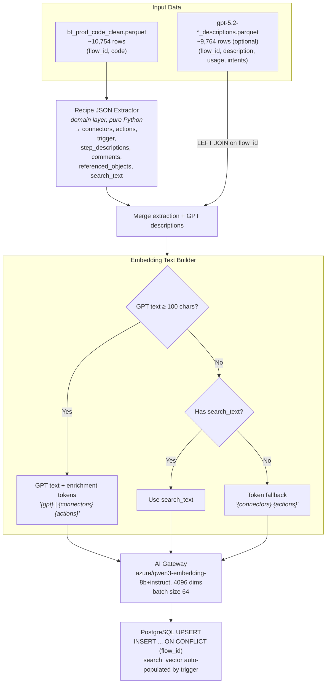
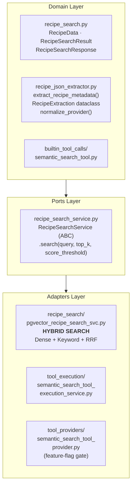
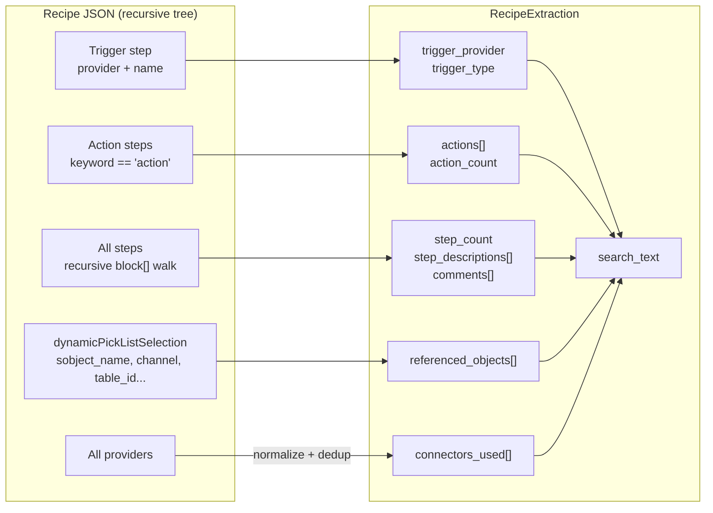
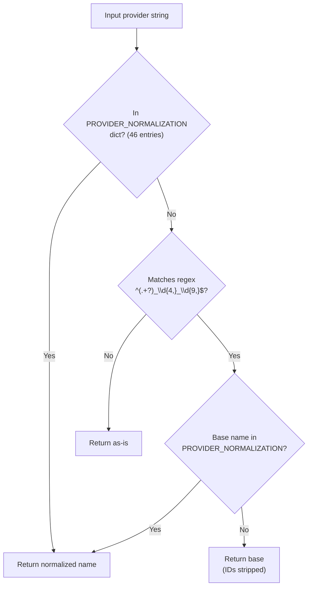
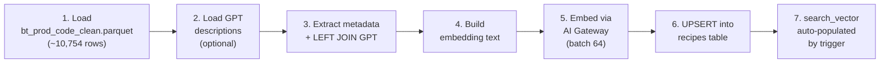

# Hybrid Search Architecture: Dense + Keyword + RRF Fusion

## Overview

Recipe search uses a **hybrid retrieval system** that combines two complementary signals in a single PostgreSQL query:

| Signal      | Method                                                             | Index                          | Strength                                |
| ----------- | ------------------------------------------------------------------ | ------------------------------ | --------------------------------------- |
| **Dense**   | `qwen3-embedding-8b+instruct` embeddings (4096d) via pgvector HNSW | `ix_recipes_embedding_hnsw`    | Broad semantic queries                  |
| **Keyword** | Vocab-weighted ILIKE (underscore=3, word=1) with pgfts/english fallback | `ix_recipes_search_vector_gin` | Exact-term / connector-specific queries |

Results from both paths are merged via **Reciprocal Rank Fusion (RRF)** — a simple, effective algorithm that combines ranked lists without needing score calibration.

### Why Hybrid?

Dense-only search (v0.1, MRR 0.88) works well for broad process queries but fails on exact-term queries:

```
Query: "recipes using workato_db_table"     → Dense: misses (no semantic match)
                                             → Keyword: hits (exact token in tsvector)

Query: "sync CRM data to warehouse"         → Dense: hits (semantic similarity)
                                             → Keyword: partial (CRM appears, but "warehouse" may not)
```

> **Note on the v0.1 RRF rejection (MRR -0.17)**: That experiment fused _two dense signals_ (template vs GPT embeddings). This is fundamentally different — we're fusing _keyword + dense_ to address different failure modes.

---

## Production Architecture

How the system runs in production. Recipe data flows through an ingestion pipeline into PostgreSQL, where it is indexed for both dense vector search and keyword search. At query time, the AIRO agent calls the `semantic_search` tool, which runs a single hybrid SQL query combining both indexes.

```mermaid
sequenceDiagram
    participant Pipeline as Recipe Pipeline
    participant Embed as Embedding Service<br/>(Qwen3-Embed 8B)
    participant PG as PostgreSQL + pgvector
    participant User
    participant AIRO as AIRO Agent (LLM)
    participant Tool as semantic_search tool
    participant QEmbed as Embedding Service<br/>(Qwen3-Embed 8B)

    rect rgb(45, 45, 65)
    Note over Pipeline,PG: Ingestion — triggered on recipe create/update
    Pipeline->>Pipeline: Extract metadata from recipe JSON<br/>(connectors, actions, trigger, descriptions)
    Pipeline->>Embed: embed(gpt_description + enrichment tokens)
    Embed-->>Pipeline: 4096-dim vector
    Pipeline->>Pipeline: Truncate 4096 → 4000 dims (drop last 96)<br/>+ L2-renormalize
    Pipeline->>PG: UPSERT recipe row<br/>(halfvec(4000) embedding + metadata columns)
    Note over PG: tsvector trigger auto-builds<br/>search_vector with A/B/C weights
    end

    rect rgb(65, 45, 45)
    Note over User,PG: Query — per user message
    User->>AIRO: "What recipes sync Salesforce to Snowflake?"
    AIRO->>Tool: tool_call: semantic_search(query)
    Tool->>QEmbed: embed(query)
    QEmbed-->>Tool: 4096-dim → truncate to 4000 + renormalize
    Tool->>PG: Single hybrid SQL query
    Note over PG: Dense CTE: halfvec(4000) HNSW (cosine)<br/>Keyword CTE: tsvector GIN (ts_rank_cd)<br/>Fusion CTE: RRF (weight_1 * dense + weight_2 * keyword)
    PG-->>Tool: Top-K results ranked by RRF score
    Tool-->>AIRO: XML recipe snippets
    AIRO-->>User: "I found these recipes that sync Salesforce to Snowflake..."
    end
```



### Embedding Strategy: Qwen3-Embed 8B + pgvector halfvec

In production, we use **Qwen3-Embed 8B** (self-hosted via Baseten), which produces **4096-dimensional** vectors. Since pgvector's `halfvec` maxes at 4000 dims, we truncate to 4000 and L2-renormalize before storage.

| Aspect           | Detail                                                                                            |
| ---------------- | ------------------------------------------------------------------------------------------------- |
| **Model**        | Qwen3-Embed 8B (4096 native dims)                                                                 |
| **Truncation**   | 4096 → 4000 dims (drop last 96, ~2.3%) + L2-renormalize                                           |
| **Storage type** | `halfvec(4000)` — 16-bit float, 2 bytes/dim = **8 KB/vector**                                     |
| **Why halfvec**  | pgvector `vector` maxes at 2000 dims — can't store 4000+. `halfvec` supports up to **4000 dims**. |
| **Index**        | HNSW with `halfvec_cosine_ops` (pgvector 0.7+)                                                    |

#### Why truncation is needed and why it's safe

Qwen3-Embed is trained with **Matryoshka Representation Learning (MRL)**, which front-loads information into earlier dimensions. The model is optimized at power-of-2 checkpoints (256, 512, 1024, 2048, 4096), but quality interpolates smoothly between them — there are no "cliffs" at non-power-of-2 values.

**4096 → 4000 truncation** drops the 96 least informative dimensions. Quality loss is ~0.01-0.1% on retrieval benchmarks — unmeasurable in practice.

After truncation, **L2-renormalization** is required to restore unit length, preserving cosine distance properties. This is the prescribed procedure from the MRL paper (Kusupati et al., NeurIPS 2022).

#### Quality at various truncation points

| Dimensions  | NDCG@10 retention (approx) | Notes                                               |
| ----------- | -------------------------- | --------------------------------------------------- |
| 4096 (full) | 100%                       | Native output                                       |
| 4000        | ~99.9%                     | Drop 96 dims — effectively lossless                 |
| 2048        | ~98.5-99.5%                | Power-of-2 MRL checkpoint                           |
| 2000        | ~98.3-99.3%                | Non-power-of-2, interpolates smoothly — fine to use |
| 1024        | ~97-99%                    | Power-of-2 MRL checkpoint                           |
| 512         | ~95-97%                    | Noticeable on hard tasks                            |
| 256         | ~92-95%                    | Good for coarse retrieval                           |

> **Non-power-of-2 is fine.** MRL doesn't create "magic" dimensions at powers of 2 — it creates a smooth information ordering. Truncating to 2000 vs 2048 is indistinguishable in practice. Pick whichever fits your system constraints.

#### pgvector type limits

| Type      | Max dims (HNSW) | Bytes/dim   | At 4000d                        |
| --------- | --------------- | ----------- | ------------------------------- |
| `vector`  | 2,000           | 4 (float32) | N/A (exceeds limit)             |
| `halfvec` | **4,000**       | 2 (float16) | **8 KB/vector**                 |
| `bit`     | 64,000          | 1/8         | 500 bytes (binary quantization) |

#### halfvec precision considerations

`halfvec` stores each dimension as float16 (~3.3 decimal digits of precision vs ~7.2 for float32). For normalized embeddings (values in [-1, 1]):

- Cosine similarity precision: ~±0.001 — rarely affects ranking order
- pgvector uses float32 accumulation internally for distance computation, so arithmetic precision loss is minimal
- **Where it matters**: only if many documents have cosine similarities differing by < 0.001 (near-identical recipes)
- **Advantage**: ~50% less memory for HNSW index, faster index build and query

#### Fallback option

If 8 KB/vector is too large at scale, truncate further to 2000 dims via Matryoshka + L2-renormalize, then use `halfvec(2000)` at 4 KB/vector. Quality at 2000d is still ~98%+ NDCG@10 retention.

> **Current dev setup**: Uses `azure/qwen3-embedding-8b+instruct` (4096d, `vector(4096)`) via the AI Gateway for convenience. The `EmbeddingProvider` protocol in the search service is model-agnostic — switching to Qwen3-Embed requires only changing the DI wiring and re-running the migration with `halfvec(4000)`.

---

## Detailed System Sequence: Data Ingestion through LLM Response

The full lifecycle with every component and internal step.



<details>
<summary>ASCII version</summary>

```
═══════════════════════════════════════════════════════════════════════════
  PHASE 1: OFFLINE DATA PIPELINE (seed script, runs once)
═══════════════════════════════════════════════════════════════════════════

  Parquet Files            Recipe JSON Extractor       AI Gateway      PostgreSQL
       │                          │                        │                │
       │  bt_prod_code_clean      │                        │                │
       │─────────────────────────>│                        │                │
       │                          │ walk_steps()           │                │
       │                          │ normalize_provider()   │                │
       │                          │ extract actions,       │                │
       │                          │   comments, DPS vals   │                │
       │                          │ build_search_text()    │                │
       │  RecipeExtraction        │                        │                │
       │<─────────────────────────│                        │                │
       │                                                   │                │
       │  LEFT JOIN GPT descriptions                       │                │
       │  Build embedding text                             │                │
       │                                                   │                │
       │  ┌─── batch of 64 ───┐                            │                │
       │  │ embed(texts[])    │                            │                │
       │──│───────────────────│───────────────────────────>│                │
       │  │ vectors[] (4096d) │                            │                │
       │<─│───────────────────│────────────────────────────│                │
       │  └───────────────────┘                            │                │
       │                                                                    │
       │  ┌─── per recipe ────┐                                             │
       │  │ UPSERT all cols   │                                             │
       │──│───────────────────│────────────────────────────────────────────>│
       │  │                   │           Trigger: recipes_search_vector_   │
       │  │                   │           update() → builds tsvector        │
       │  │                   │           Weight A: connectors, actions     │
       │  │                   │           Weight B: GPT desc, step desc     │
       │  │                   │           Weight C: comments, refs          │
       │  └───────────────────┘                                             │

═══════════════════════════════════════════════════════════════════════════
  PHASE 2: ONLINE SEARCH (per user query)
═══════════════════════════════════════════════════════════════════════════

  User        LLM          ToolExecSvc    SearchService   AI Gateway   PostgreSQL
   │           │               │               │             │             │
   │ question  │               │               │             │             │
   │──────────>│               │               │             │             │
   │           │ tool_call     │               │             │             │
   │           │──────────────>│               │             │             │
   │           │               │ search()      │             │             │
   │           │               │──────────────>│             │             │
   │           │               │               │ embed query │             │
   │           │               │               │────────────>│             │
   │           │               │               │ query_vec   │             │
   │           │               │               │<────────────│             │
   │           │               │               │                           │
   │           │               │               │  Hybrid SQL (3 CTEs)      │
   │           │               │               │──────────────────────────>│
   │           │               │               │                           │
   │           │               │               │      ┌─ Dense CTE (HNSW) │
   │           │               │               │      ├─ Keyword CTE (GIN)│
   │           │               │               │      └─ RRF Fusion       │
   │           │               │               │                           │
   │           │               │               │  rows + rrf_score         │
   │           │               │               │<──────────────────────────│
   │           │               │               │                           │
   │           │               │  Response     │                           │
   │           │               │<──────────────│                           │
   │           │  XML results  │               │                           │
   │           │<──────────────│               │                           │
   │           │               │               │                           │
   │  answer   │               │               │                           │
   │<──────────│               │               │                           │
```

</details>

---

## System Architecture

### End-to-End Search Flow



<details>
<summary>ASCII version</summary>

```
                            User Query
                            "salesforce to snowflake sync"
                                │
                                ▼
                    ┌───────────────────────┐
                    │   Embedding Service   │
                    │   AI Gateway / qwen3-embedding-8b+instruct  │
                    │   4096 dimensions     │
                    └───────────┬───────────┘
                                │ query_vec (4096-dim float[])
                                ▼
        ┌───────────────────────────────────────────────────┐
        │              PostgreSQL (single query)            │
        │                                                   │
        │   ┌─────────────────┐   ┌─────────────────────┐  │
        │   │   Dense CTE     │   │    Keyword CTE      │  │
        │   │ embedding <=>   │   │ search_vector @@     │  │
        │   │   query_vec     │   │   websearch_to_      │  │
        │   │ HNSW index      │   │   tsquery(query)     │  │
        │   │ → candidate_k   │   │ GIN index            │  │
        │   │   ranked rows   │   │ → candidate_k        │  │
        │   └────────┬────────┘   └──────────┬───────────┘  │
        │            └───────────┬───────────┘              │
        │                        ▼                          │
        │            ┌───────────────────────┐              │
        │            │   Fusion CTE (RRF)    │              │
        │            │  FULL OUTER JOIN      │              │
        │            │  score =              │              │
        │            │    w_d/(k + rank_d)   │              │
        │            │  + w_k/(k + rank_k)   │              │
        │            │  ORDER BY score DESC  │              │
        │            │  LIMIT top_k          │              │
        │            └───────────┬───────────┘              │
        └────────────────────────┼──────────────────────────┘
                                 │
                                 ▼
                    RecipeSearchResponse
                    results + confident
```

</details>

### Data Pipeline (Offline Seeding)



<details>
<summary>ASCII version</summary>

```
 bt_prod_code_clean.parquet          gpt-5.2-*_descriptions.parquet
 (~10,754 rows)                      (optional, ~9,764 rows)
       │                                         │
       ▼                                         │
 ┌─────────────────────────┐                     │
 │  Recipe JSON Extractor  │                     │
 │  (domain layer)         │                     │
 │  → connectors, actions, │                     │
 │    trigger, comments,   │                     │
 │    search_text          │                     │
 └────────┬────────────────┘                     │
          └──────────┬───────────────────────────┘
                     │ LEFT JOIN on flow_id
                     ▼
          ┌──────────────────────────────┐
          │  Embedding Text Builder      │
          │  GPT ≥ 100 chars? → enrich   │
          │  Else → search_text/tokens   │
          └────────────┬─────────────────┘
                       ▼
          ┌──────────────────────────────┐
          │  AI Gateway (qwen3-embedding-8b+instruct, 4096d)  │
          │  batch size 64              │
          └────────────┬─────────────────┘
                       ▼
          ┌──────────────────────────────┐
          │  PostgreSQL UPSERT          │
          │  search_vector auto by      │
          │  trigger                     │
          └──────────────────────────────┘
```

</details>

### Hexagonal Layer Placement



<details>
<summary>ASCII version</summary>

```
┌────────────────────────────────────────────────────────┐
│  DOMAIN: recipe_search.py · recipe_json_extractor.py   │
│          builtin_tool_calls/semantic_search_tool.py     │
└──────────────────────┬─────────────────────────────────┘
                       │
┌──────────────────────▼─────────────────────────────────┐
│  PORTS: recipe_search_service.py (ABC)                 │
└──────────────────────┬─────────────────────────────────┘
                       │
    ┌──────────────────┼──────────────────────┐
    │                  │                      │
┌───▼──────────┐ ┌────▼─────────┐ ┌──────────▼───────┐
│ pgvector_    │ │ tool_exec    │ │ tool_provider    │
│ recipe_svc   │ │ service      │ │ (feature-flag)   │
│ ★ HYBRID     │ └──────────────┘ └──────────────────┘
└──────────────┘
```

</details>

---

## Recipe JSON Extraction

`src/domain/recipe_json_extractor.py` — pure domain logic, no external dependencies.

### What It Extracts



<details>
<summary>ASCII version</summary>

```
Recipe JSON (recursive tree)
│
├── Trigger step
│   ├── provider → normalize → trigger_provider
│   └── name    →             trigger_type = "{provider}.{name}"
│
├── Action steps (keyword == "action")
│   ├── provider.name → actions[] (deduped, sorted)
│   └── count        → action_count
│
├── All steps (recursive walk through block[])
│   ├── count         → step_count
│   ├── description   → step_descriptions[] (HTML stripped)
│   ├── comment       → comments[]
│   └── dynamicPickListSelection → referenced_objects[]
│
├── Providers (all steps)
│   └── normalize + dedup → connectors_used[]
│
└── All above → search_text (structured concatenation)
```

</details>

### Provider Normalization



<details>
<summary>ASCII version</summary>

```
Input provider string
  │
  ├── In PROVIDER_NORMALIZATION dict? (46 entries)
  │   └── YES → Return normalized name
  │
  ├── Matches regex ^(.+?)_\d{4,}_\d{9,}$ ?
  │   ├── YES → Base name in dict?
  │   │         ├── YES → Return normalized name
  │   │         └── NO  → Return base (IDs stripped)
  │   └── NO  → Return as-is
```

</details>

**Examples:**
| Input | Output |
|-------|--------|
| `slack_connector_3436233_1721275312` | `slack` |
| `ops_genie_connector` | `opsgenie` |
| `fresh_desk` | `freshdesk` |
| `salesforce` | `salesforce` (passthrough) |

### search_text Format

Pre-built concatenation used for embedding fallback and full-text indexing:

```
Trigger: salesforce.new_record
Connectors: salesforce, snowflake
Actions: salesforce.get_record, snowflake.upsert_row
References: Account, Contact
Channels: #engineering-alerts
Tables: users, orders
Salesforce objects: Account, Contact
Control flow: foreach, if
Step comments: Fetch from CRM | Upsert to warehouse
Step descriptions: Get new contact record | Insert into analytics table
```

---

## Database Schema

### Table: `recipes`

| Column               | Type           | Notes                                         |
| -------------------- | -------------- | --------------------------------------------- |
| `flow_id`            | `BIGINT` (PK)  | Recipe identifier                             |
| `connectors_used`    | `TEXT[]`       | Normalized connector names                    |
| `trigger_type`       | `TEXT`         | `"provider.trigger_name"`                     |
| `trigger_provider`   | `TEXT`         | Normalized trigger provider                   |
| `step_count`         | `INTEGER`      | Total flattened steps                         |
| `action_count`       | `INTEGER`      | Action steps only                             |
| `actions`            | `TEXT[]`       | `"provider.action_name"` (NEW)                |
| `referenced_objects` | `TEXT[]`       | DPS-extracted object names (NEW)              |
| `search_text`        | `TEXT`         | Pre-built searchable text (NEW)               |
| `search_vector`      | `TSVECTOR`     | Auto-populated by trigger (NEW)               |
| `embedding`          | `VECTOR(4096)` | Dense embedding (qwen3-embedding-8b+instruct) |

### Indexes

| Name                           | Type               | Column(s)                     |
| ------------------------------ | ------------------ | ----------------------------- |
| `ix_recipes_embedding_hnsw`    | HNSW (m=16, ef=64) | `embedding vector_cosine_ops` |
| `ix_recipes_search_vector_gin` | GIN                | `search_vector` (NEW)         |
| `ix_recipes_actions_gin`       | GIN                | `actions` (NEW)               |
| `ix_recipes_connectors_gin`    | GIN                | `connectors_used`             |
| `ix_recipes_trigger_type`      | B-tree             | `trigger_type`                |

---

## Search Algorithm

### 1. `keywords+fts` — Keyword Search with FTS Fallback

`keywords+fts` is a vocabulary-driven ILIKE search with a PostgreSQL FTS fallback.

At startup, a **technical vocabulary** is automatically extracted from the recipe corpus (~2,000 terms):

- **Connector names** — e.g. `salesforce`, `workato_db_table`, `google_sheets`
- **Action names** — parsed from `action: X / Y` lines in recipe text
- **Field names ≥ 8 characters** — parsed from `fields:` lines
- **Alphabetic sub-words ≥ 5 chars** from compound connector names, filtered to those appearing in fewer than 50% of recipes

Vocab tokens are split into two tiers:

- **Underscore tokens** — compound identifiers containing `_` (e.g. `workato_db_table`, `get_records`). Precise and unambiguous.
- **Word tokens** — single-word app names (e.g. `salesforce`, `snowflake`). Broader.

**Scoring:** WHERE clause is OR across all tokens. Each underscore token match = 3 points, each word token match = 1 point. Higher total score ranks first.

**pgfts fallback:** If ILIKE returns fewer than k results, the gap is filled with PostgreSQL FTS results (`pgfts/english`: Porter stemmer + stopword removal) that score above a minimum `ts_rank` threshold (≥ 0.03) and have not already been returned by ILIKE. This provides robustness when connector or action names in the query are not yet in the technical vocabulary.

---

### 2. `hybrid` — Keyword + Dense Fusion

`hybrid` fuses the `keywords+fts` keyword leg with dense vector search using **weighted Reciprocal Rank Fusion**. The dense leg uses **Qwen3-Embedding-8B+instruct**, selected after benchmarking multiple embedding models (including `text-embedding-3-large` and the base `Qwen3-Embedding-8B` without instruction) — Qwen3-8B+instruct outperformed all others across all three query categories.

```
score(doc) = w_kw × 1/(60 + rank_kw) + w_dense × 1/(60 + rank_dense)
```

**Weight assignment by query signal:**

| Signal detected in query                    | w_kw | w_dense | Rationale                                                 |
| ------------------------------------------- | ---- | ------- | --------------------------------------------------------- |
| Underscore tokens (e.g. `workato_db_table`) | 2.0  | 1.0     | Exact technical identifiers — keyword leg is more precise |
| Word-only app names (e.g. `salesforce`)     | 1.0  | 2.0     | Broad terms — dense handles ambiguity better              |
| No vocab tokens (pure business language)    | 0.0  | 1.0     | Keyword leg returns nothing → pure dense                  |

Each leg fetches k×3 candidates before fusion; the fused list is then truncated to top-k. The `keywords+fts` leg uses weighted ILIKE scoring (underscore=3, word=1) with a pgfts/english gap-fill if ILIKE returns fewer than k×3 candidates.

**Results:**

| Category                             | Method                  | Recall@5 | MRR       | Avg Strong Hits@5 |
| ------------------------------------ | ----------------------- | -------- | --------- | ----------------- |
| **Cat 1 — Business Language** (50 q) | `keywords+fts`          | 0.09     | 0.084     | 0.14              |
|                                      | dense/Qwen3-8B+instruct | **0.43** | **0.372** | **0.54**          |
|                                      | **hybrid**              | **0.43** | 0.337     | **0.54**          |
| **Cat 2 — Technical Feature** (50 q) | `keywords+fts`          | 0.73     | 0.540     | 0.74              |
|                                      | dense/Qwen3-8B+instruct | 0.91     | 0.789     | 0.92              |
|                                      | **hybrid**              | **0.95** | **0.789** | **0.96**          |
| **Cat 3 — Dependency Lookup** (49 q) | `keywords+fts`          | 0.87     | 0.760     | 0.96              |
|                                      | dense/Qwen3-8B+instruct | 0.74     | 0.579     | 0.80              |
|                                      | **hybrid**              | **0.87** | **0.749** | **0.98**          |

`hybrid` achieves the best balance across all three categories — no single non-hybrid method does.

---

## Configuration

### `keywords+fts` Parameters

Defined in `pipeline/03_evaluate_postgre/evaluate_fulltext.py`:

| Parameter           | Default | Description                                                                                 |
| ------------------- | ------- | ------------------------------------------------------------------------------------------- |
| `UNDERSCORE_WEIGHT` | `3`     | Score weight per underscore token match (compound technical identifiers)                    |
| `WORD_WEIGHT`       | `1`     | Score weight per word token match (single-word app names)                                   |
| `PGFTS_MIN_RANK`    | `0.03`  | Minimum `ts_rank` for pgfts fallback results; scores below this are treated as noise        |
| `FUZZY_MIN_LEN`     | `5`     | Minimum query token length to attempt fuzzy correction (short tokens risk false matches)    |
| `FUZZY_THRESHOLD`   | `0.7`   | Trigram similarity threshold for fuzzy vocab correction — conservative, near-identical only |

### `hybrid` Parameters

Defined in `pipeline/03_evaluate_postgre/evaluate_hybrid.py`:

| Parameter            | Default                            | Description                                                                       |
| -------------------- | ---------------------------------- | --------------------------------------------------------------------------------- |
| `EMBED_MODEL`        | `Qwen/Qwen3-Embedding-8B+instruct` | Dense embedding model — outperformed all other benchmarked candidates             |
| `RRF_K`              | `60`                               | RRF smoothing constant (Cormack et al.); higher = more conservative fusion        |
| `top_k`              | `5`                                | Final number of results returned                                                  |
| Candidate multiplier | `k × 3`                            | Each leg retrieves k×3 candidates before fusion to give RRF enough to rerank from |

**RRF weights are dynamic**, assigned per query based on detected vocab signal:

| Signal in query                          | `w_kw` | `w_dense` | Rationale                                             |
| ---------------------------------------- | ------ | --------- | ----------------------------------------------------- |
| Underscore tokens (e.g. `get_records`)   | 2.0    | 1.0       | Exact technical identifiers — keyword is more precise |
| Word-only tokens (e.g. `salesforce`)     | 1.0    | 2.0       | Broad terms — dense handles ambiguity better          |
| No vocab tokens (pure business language) | 0.0    | 1.0       | Keyword returns nothing → route entirely to dense     |

---

### Pipeline Steps



<details>
<summary>ASCII version</summary>

```
1. Load bt_prod_code_clean.parquet  →  2. Load GPT descriptions (optional)
       →  3. Extract metadata + LEFT JOIN GPT
       →  4. Build embedding text
       →  5. Embed via AI Gateway (batch 64)
       →  6. UPSERT into recipes table
       →  7. search_vector auto-populated by trigger
```

</details>

---

## Migration

```bash
# Apply (from project root)
alembic upgrade head

# Verify schema
psql -h localhost -p 5432 -U user -d chatapi -c "\d recipes"

# Verify tsvector population after seeding
psql -h localhost -p 5432 -U user -d chatapi \
  -c "SELECT flow_id, search_vector IS NOT NULL AS has_sv FROM recipes LIMIT 5;"

# Smoke test keyword search
psql -h localhost -p 5432 -U user -d chatapi \
  -c "SELECT flow_id, ts_rank_cd(search_vector, websearch_to_tsquery('english', 'salesforce snowflake')) AS score
      FROM recipes
      WHERE search_vector @@ websearch_to_tsquery('english', 'salesforce snowflake')
      ORDER BY score DESC LIMIT 5;"

# Rollback
alembic downgrade -1
```

Migration file: `alembic/versions/2026_04_06_1200-e2f3a4b5c6d7_add_recipes_table.py`

Not yet deployed — modifiable in-place on the feature branch.

---

## Key Design Decisions

| Decision                         | Rationale                                                                                                                                                                           |
| -------------------------------- | ----------------------------------------------------------------------------------------------------------------------------------------------------------------------------------- |
| **Single SQL query (CTEs)**      | One DB round-trip instead of two separate queries + application-side fusion. Uses both HNSW and GIN indexes in the same execution plan.                                             |
| **`websearch_to_tsquery`**       | Handles natural query syntax: quotes for phrases, `OR`, `-` for exclusion. More user-friendly than `plainto_tsquery`.                                                               |
| **`ts_rank_cd` (cover density)** | Rewards proximity of matching terms, better ranking than basic `ts_rank` for natural language queries.                                                                              |
| **`FULL OUTER JOIN`**            | Ensures recipes from either path are included. If query has no keyword matches (e.g., purely semantic), all dense results still appear.                                             |
| **Weighted tsvector (A/B/C)**    | Connector/action matches (A) rank higher than same term appearing in a step comment (C). Aligns keyword ranking with what users actually search for.                                |
| **Trigger-based tsvector**       | `search_vector` auto-computed on INSERT/UPDATE. No application code needed to maintain it. Stays in sync with data changes.                                                         |
| **RRF over learned fusion**      | RRF is parameter-light (just weights + k), doesn't need score calibration, and is well-studied. Good starting point before exploring more complex fusion.                           |
| **Threshold at 0.0**             | RRF scores are on a completely different scale (~0.016 max vs cosine 0-1). Setting to 0 and relying on top_k avoids accidentally filtering all results. Will calibrate during eval. |

---

## Research Gap Analysis & Future Improvements

Based on the Acumen V2 Embedding Strategy Report (April 2026), which evaluates our architecture against current IR research. This section documents where the implementation aligns with research recommendations, identified gaps, and planned improvements.

### What Aligns with Research

| Area                     | Report Recommendation                                           | Our Implementation                                                                                            | Status  |
| ------------------------ | --------------------------------------------------------------- | ------------------------------------------------------------------------------------------------------------- | ------- |
| **Vector storage**       | `halfvec(4000)` for 10K corpus                                  | `halfvec(4000)` planned for production (documented in Production Architecture above); dev uses `vector(4096)` | Aligned |
| **MRL truncation**       | 4096→4000 dims, L2-renormalize                                  | Documented in Embedding Strategy section above                                                                | Aligned |
| **NL descriptions**      | Use GPT-generated descriptions as primary embedding signal      | 4 GPT fields (description, usage, short/verbose intent) as Priority 1 embedding text                          | Aligned |
| **Multi-perspective NL** | Intent-focused, integration-focused, logic-focused descriptions | 4 GPT fields cover different perspectives                                                                     | Aligned |
| **RRF fusion**           | Keep multi-source RRF (Cormack et al. 2009)                     | Dense + Keyword RRF with configurable weights (0.7/0.3)                                                       | Aligned |
| **Keyword search**       | BM25/full-text as separate retrieval source                     | PostgreSQL tsvector with weighted zones (A/B/C) via GIN index                                                 | Aligned |
| **Configurable weights** | Tune via eval                                                   | All RRF params env-configurable                                                                               | Aligned |

### Identified Gaps

| Gap                                         | Report Evidence                                                                                                                                                                                        | Severity | Effort | Details                                                                                                                                                                                                                                                                      |
| ------------------------------------------- | ------------------------------------------------------------------------------------------------------------------------------------------------------------------------------------------------------ | -------- | ------ | ---------------------------------------------------------------------------------------------------------------------------------------------------------------------------------------------------------------------------------------------------------------------------- |
| **No separate structured embedding source** | Doc2Query++ dual-index (separate embeddings for NL + structured) outperforms concatenation across 5 datasets (arXiv:2510.09557)                                                                        | Medium   | High   | Currently, GPT text + structural tokens are concatenated into a single embedding. The report suggests a 3rd RRF source — a separate embedding of structured data (JSON/YAML/`search_text`) — could add value. Would require a 2nd embedding column, 3rd CTE, and re-seeding. |
| **No cross-encoder reranking**              | Enterprise RAG study (arXiv:2603.02153) found reranker absorbs fusion gains; however, the same study notes fusion is essential for "recall-scarce" queries where the primary retriever misses entirely | Low      | Medium | Our system has no reranker, which actually **strengthens the case for RRF** — there's no reranker to compensate for fusion's absence. Adding a reranker post-RRF could improve precision but may make some RRF sources redundant.                                            |
| **No GPT description validation**           | LLM-generated descriptions risk hallucinating apps/steps not in the recipe, creating false positives                                                                                                   | Medium   | Medium | No systematic validation of GPT descriptions against recipe JSON. Should sample 100 descriptions and audit for: mentioned apps actually present, described steps are real, framing matches search intent.                                                                    |
| **No ablation experiments**                 | Can't confirm keyword source adds value without measurement                                                                                                                                            | Medium   | Low    | Need to run eval with `RRF_WEIGHT_KEYWORD=0` (dense-only) vs current 0.3 to quantify keyword lift. Also test removing dense to confirm it's the primary signal.                                                                                                              |
| **No JSON vs YAML vs NL A/B test**          | Report rates "JSON syntax is noise" claim as **Low confidence** — Qwen3 scores 80.68 on MTEB Code benchmarks, suggesting it may use JSON structure as semantic signal                                  | Low      | Medium | Never tested whether raw JSON, cleaned YAML, or NL descriptions produce better embeddings for our corpus. The assumption that NL is best is inferential, not validated.                                                                                                      |

### Strengths Not Covered by Report

Things our implementation does well that the report doesn't explicitly address:

- **Enrichment tokens appended to GPT text**: `_build_embedding_text` adds connector/action tokens to GPT descriptions, bridging the vocabulary gap between NL descriptions and technical queries. This is a pragmatic middle ground between full dual-index and pure concatenation.
- **Tiered fallback logic**: Recipes without GPT descriptions still get embedded via `search_text` or raw tokens, ensuring 100% embedding coverage across the corpus.
- **Weighted tsvector zones (A/B/C)**: The report says "BM25 keyword" generically, but our implementation has field-level boosting built into the tsvector trigger — connector/action matches (Weight A) rank higher than incidental mentions in comments (Weight C).
- **Single-query CTE architecture**: The report discusses multi-source fusion as separate queries + application-side merge. Our single SQL with CTEs is more efficient (one DB round-trip, both indexes used in same execution plan).

### The Reranker Question

The report's most nuanced finding: a 2026 enterprise RAG study (arXiv:2603.02153) showed that cross-encoder reranking absorbs most fusion gains — fusion variants failed to outperform single-query baselines on Hit@10.

**However**, there's a critical distinction:

- That study tested **query-level fusion** (reformulating the same query). A good reranker replicates query diversity.
- Our system uses **source-level fusion** (same query against different representations: dense embeddings vs keyword tsvector). These capture genuinely different retrieval angles that a reranker cannot replicate — a relevant document may only appear in one source's candidate set.

**Implication**: Adding a reranker could improve precision on the final top-K, but should **not** be used as justification to remove keyword search. The keyword path rescues exact-term queries that dense embeddings miss entirely ("recipes using `workato_db_table`").

### Proposed Experiments (Priority Order)

1. **GPT description audit** (Medium effort)
   - Sample 100 GPT descriptions
   - Verify against recipe JSON: all mentioned apps present? Steps real? Framing useful?
   - Quantify hallucination rate — if > 5%, consider validation pipeline

2. **Weight grid search** (Low effort)
   - `w_dense` in [0.5, 0.6, 0.7, 0.8, 0.9], `w_kw = 1 - w_dense`
   - `rrf_k` in [20, 40, 60, 80]
   - Optimize for MRR@20 on Cat 1 + Cat 2 combined

3. **Recall-scarce query analysis** (Low effort)
   - Identify queries where dense top-10 has zero relevant results
   - These are where keyword fusion earns its value
   - Quantify what percentage of eval set falls into this category

4. **Dual-index structured embedding** (High effort, contingent on #1)
   - Only if ablation shows keyword alone isn't sufficient for Cat 2
   - Embed `search_text` separately as a 2nd dense source
   - Add 3rd CTE to hybrid SQL, extend RRF to three-way fusion
   - Re-evaluate: does 3-source RRF beat 2-source for Cat 2 queries?

### Key References

| #   | Citation                                                    | Relevance                                       |
| --- | ----------------------------------------------------------- | ----------------------------------------------- |
| 1   | Cormack et al. (2009), SIGIR — RRF paper                    | Foundation for our fusion approach              |
| 2   | Kusupati et al. (2022), NeurIPS — MRL                       | Justifies Qwen3 truncation strategy             |
| 3   | Doc2Query++ (2025), arXiv:2510.09557                        | Evidence for separate embedding sources         |
| 4   | Enterprise RAG (2026), arXiv:2603.02153                     | Counter-evidence: reranker absorbs fusion gains |
| 5   | Wu & Cao (2024), arXiv:2404.05825 — LLM-Augmented Retrieval | Supports NL description approach                |
| 6   | r2decide production report (2025)                           | Caution on RAG-Fusion instability               |
| 7   | Zhang et al. (2025), arXiv:2506.05176 — Qwen3 Embedding     | Model-specific MRL details                      |
