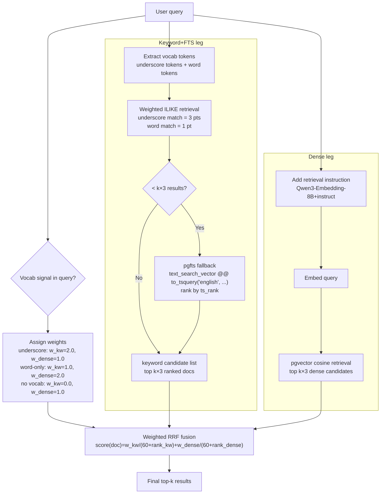

# Natural Language Semantic Search: Methodology & Evaluation

## The Challenge

Automation recipes are stored as structured technical metadata: connector names, action types, step definitions, and field identifiers. When a user asks a business question — _"which automations handle our employee onboarding?"_ — there is no literal overlap with the recipe text. Bridging this semantic gap is the core problem.

We defined three query categories to represent the range of real-world user intent:

| Category                         | User Intent                                         | Example                                                                                                           |
| -------------------------------- | --------------------------------------------------- | ----------------------------------------------------------------------------------------------------------------- |
| **1 — Business Oriented**        | Find recipes by a business process in plain English | _"Which automations handle employee onboarding?"_                                                                 |
| **2 — Actions Oriented**         | Find recipes by specific actions                    | _"Slack bot that looks up Salesforce accounts and logs to Snowflake"_                                             |
| **3 — DataPill Fields Oriented** | Find recipes by specific fields                     | _"If I update the Custom_Status\_\_c field in my Salesforce Opportunity object, which recipes will be impacted?"_ |

---

## Part 1: Evaluation Dataset Synthesis

Building a trustworthy benchmark required 150 queries (50 per category) with ground-truth relevance labels across a diverse recipe corpus. This was done through a structured, three-stage pipeline.

### Stage 1 — Data Preparation

Starting from ~10,700 production recipe versions, we sampled approximately 2,300 recipes from the top 30 authors by volume. Each recipe's nested JSON structure was converted into a structured text summary in two variants:

- **With comments**: includes inline author comments — used only for query generation
- **Without comments**: comments stripped — used for all retrieval (embedding index and keyword search)

This separation is deliberate: **we test whether the retrieval system understands a recipe purely from its structure and logic, without relying on human-written commentary.** In production, comment quality is inconsistent and many recipes have none at all.

### Stage 2 — Evaluation Dataset Synthesis

#### Phase 1 — Seed Selection

We selected ~639 "seed" recipes to anchor the evaluation. The algorithm:

- Excludes "infrastructure" connectors common to nearly all recipes (noise reduction)
- Ranks remaining recipes by connector diversity and workflow complexity
- Greedily selects recipes whose connector sets are sufficiently distinct from already-chosen seeds

The pool is deliberately kept to ~639 recipes so that Phase 4 can exhaustively score every (query, recipe) pair using LLMs — ensuring no relevant recipe is overlooked in the ground truth. Retrieval evaluation in Parts 2 and 3 also searches against this same 639-recipe pool.

#### Phase 2 — Query Generation

For each seed recipe, GPT-5.2 generated one query per category (~639 candidate queries per category). Queries were constrained to be a single sentence, grounded in the seed recipe, and written in the style of that category. The **comment-inclusive** recipe text is used here; comments are stripped before any retrieval happens.

#### Phase 3 — Query Selection (Diversity Filtering)

From ~639 candidates per category, exactly **50 diverse queries** were selected using embedding-based similarity filtering. Queries were ranked by specificity (length), then greedily kept only if sufficiently dissimilar from already-selected queries.

#### Phase 4 — Dual-Model Relevance Scoring

For each of the 50 selected queries, every recipe in the seed pool was scored for relevance by two independent LLMs:

- **GPT-5.2** (Azure OpenAI)
- **Claude Sonnet** (AWS Bedrock)

Each model assigned one of three labels:

| Label                | Meaning                                 | Role in evaluation                   |
| -------------------- | --------------------------------------- | ------------------------------------ |
| **Strongly Related** | Recipe is a primary match for the query | **Used as ground truth** ✓           |
| **Weakly Related**   | Recipe is tangentially relevant         | Tracked separately, not ground truth |
| **Not Related**      | No meaningful connection                | Excluded                             |

Only **Strongly Related** labels where both models agree form the ground truth. Where they disagreed, a **third LLM adjudication call** resolved the conflict.

#### Phase 5 — Filtering & Aggregation

Final ground-truth labels were aggregated per query into `strong_list` and `weak_list`. Queries where the source recipe itself was not strongly related were dropped. The resulting dataset contains **50 queries per category, each with a curated list of verified relevant recipes**.

---

## Part 2: `keywords+fts` — Keyword Strategy

### How It Works

`keywords+fts` is a vocabulary-driven ILIKE search with a PostgreSQL FTS fallback.

At startup, a **technical vocabulary** is automatically extracted from the recipe corpus (~2,000 terms):

- **Connector names** — e.g. `salesforce`, `workato_db_table`, `google_sheets`
- **Action names** — parsed from `action: X / Y` lines in recipe text
- **Field names ≥ 8 characters** — parsed from `fields:` lines
- **Alphabetic sub-words ≥ 5 chars** from compound connector names, filtered to those appearing in fewer than 50% of recipes

Vocab tokens are split into two tiers:

- **Underscore tokens** — compound identifiers containing `_` (e.g. `workato_db_table`, `get_records`). Precise and unambiguous.
- **Word tokens** — single-word app names (e.g. `salesforce`, `snowflake`). Broader.

**Scoring:** WHERE clause is OR across all tokens. Each underscore token match = 3 points, each word token match = 1 point. Higher total score ranks first.

**pgfts fallback:** If ILIKE returns fewer than k results, the gap is filled with PostgreSQL FTS results (`pgfts/english`: Porter stemmer + stopword removal) that score above a minimum `ts_rank` threshold (≥ 0.03) and have not already been returned by ILIKE. This provides robustness when connector or action names in the query are not yet in the technical vocabulary.

Each result is labelled by how it was retrieved:

| Label            | Meaning                                                  |
| ---------------- | -------------------------------------------------------- |
| `keyword`        | Returned by ILIKE — vocab match found                    |
| `keyword+pgfts`  | ILIKE returned < k results; gap filled by pgfts fallback |
| `no_vocab+pgfts` | No vocab tokens in query; all results from pgfts         |

### Observed Fallback Rates (k=5)

| Category                         | `keyword` | `keyword+pgfts` | `no_vocab+pgfts` |
| -------------------------------- | --------- | --------------- | ---------------- |
| Cat 1 — Business Language (50 q) | 29        | 8               | 13               |
| Cat 2 — Technical Feature (50 q) | 50        | 0               | 0                |
| Cat 3 — Dependency Lookup (49 q) | 44        | 5               | 0                |

---

## Part 3: `hybrid` — Hybrid Strategy

### How It Works

`hybrid` fuses the `keywords+fts` keyword leg with dense vector search using **weighted Reciprocal Rank Fusion**. The dense leg uses **Qwen3-Embedding-8B+instruct**, selected after benchmarking multiple embedding models (including `text-embedding-3-large` and the base `Qwen3-Embedding-8B` without instruction) — Qwen3-8B+instruct outperformed all others across all three query categories.



```
score(doc) = w_kw × 1/(60 + rank_kw) + w_dense × 1/(60 + rank_dense)
```

**Weight assignment by query signal:**

| Signal detected in query                    | w_kw | w_dense | Rationale                                                 |
| ------------------------------------------- | ---- | ------- | --------------------------------------------------------- |
| Underscore tokens (e.g. `workato_db_table`) | 2.0  | 1.0     | Exact technical identifiers — keyword leg is more precise |
| Word-only app names (e.g. `salesforce`)     | 1.0  | 2.0     | Broad terms — dense handles ambiguity better              |
| No vocab tokens (pure business language)    | 0.0  | 1.0     | Keyword leg returns nothing → pure dense                  |

Each leg fetches k×3 candidates before fusion; the fused list is then truncated to top-k.

The `keywords+fts` leg contributes: weighted ILIKE scoring (underscore=3, word=1) with a pgfts/english gap-fill if ILIKE returns fewer than k×3 candidates. This gives the keyword leg better ranking than a basic AND→OR fallback — underscore-heavy dependency queries are prioritised directly — while the pgfts fallback adds robustness to connector names not yet in the vocabulary.

### Results

**Category 1 — Business Language** (50 queries)

| Method                  | Recall@5 | MRR       | Avg Strong Hits@5 |
| ----------------------- | -------- | --------- | ----------------- |
| `keywords+fts`          | 0.09     | 0.084     | 0.14              |
| dense/Qwen3-8B+instruct | **0.43** | **0.372** | **0.54**          |
| **hybrid**              | **0.43** | 0.337     | **0.54**          |

**Category 2 — Technical Feature** (50 queries)

| Method                  | Recall@5 | MRR       | Avg Strong Hits@5 |
| ----------------------- | -------- | --------- | ----------------- |
| `keywords+fts`          | 0.73     | 0.540     | 0.74              |
| dense/Qwen3-8B+instruct | 0.91     | 0.789     | 0.92              |
| **hybrid**              | **0.95** | **0.789** | **0.96**          |

**Category 3 — Dependency Lookup** (49 queries)

| Method                  | Recall@5 | MRR       | Avg Strong Hits@5 |
| ----------------------- | -------- | --------- | ----------------- |
| `keywords+fts`          | 0.87     | 0.760     | 0.96              |
| dense/Qwen3-8B+instruct | 0.74     | 0.579     | 0.80              |
| **hybrid**              | **0.87** | **0.749** | **0.98**          |

**Key observations:**

- `hybrid` achieves the best balance across all three categories — no single non-hybrid method does.

---

## Next Steps

### 1 — Search Backend Benchmarking

Benchmarked using **Qwen3-Embedding-8B with instruction** as the embedding model. pgvector evaluation established that:

- `halfvec(4000)` HNSW fast search matches exact search quality across all three categories — no measurable recall or MRR degradation.
- Further truncating to the first **2,000 dimensions** also produces the same results, suggesting the model's information is concentrated in the leading dimensions (consistent with Matryoshka representation learning).

This means pgvector with HNSW on `halfvec(4000)` or `halfvec(2000)` is a viable production configuration. The remaining question is latency at production scale — the eval corpus of 639 recipes is too small for HNSW to show its typical speed advantage over exact scan.

| Backend           | Notes                                                                                 |
| ----------------- | ------------------------------------------------------------------------------------- |
| **pgvector**      | HNSW fast search validated on eval set; production-scale latency benchmarking pending |
| **OpenSearch**    | Managed, horizontally scalable, native hybrid search support                          |
| **Matrix Search** | Available within the company                                                          |

Metrics: query latency (p50/p99), throughput (QPS), recall vs. exact-search, infrastructure cost.

### 2 — Evaluation Dataset Review with BT Team

Grace and Ee Liang shared that many teams are interested in Category 3 queries. Examples will be shared with the BT team and other teams for feedback.
